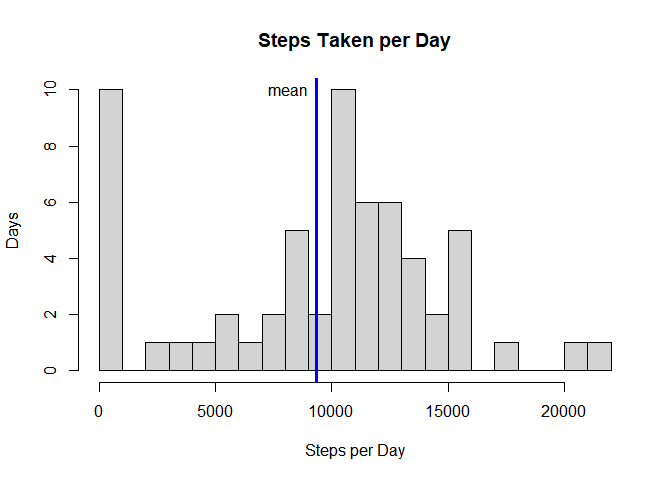
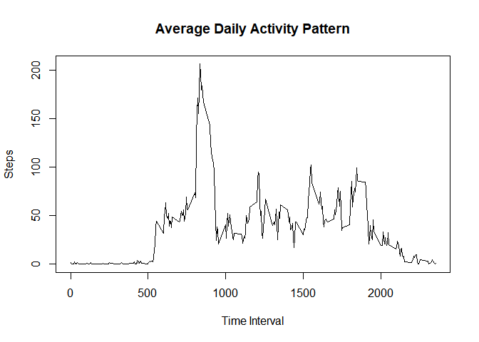
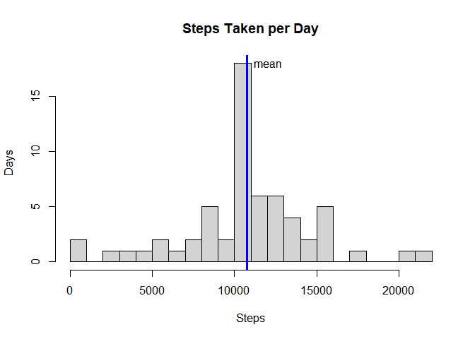
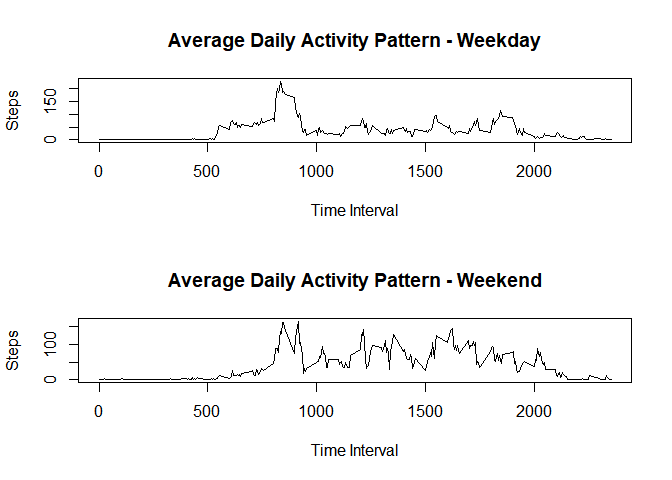

The variables included in this dataset are:

* **steps**: Number of steps taken in a 5-minute interval (missing
    values are coded as `NA`)

* **date**: The date on which the measurement was taken in YYYY-MM-DD
    format

* **interval**: Identifier for the 5-minute interval in which
    measurement was taken

## Loading and preprocessing the data

```r
activitydata <- read.csv("./activity.csv", header = TRUE, stringsAsFactors = TRUE)
```

## What is mean total number of steps taken per day?

```r
stepsperday <- tapply(activitydata$steps, activitydata$date, sum, na.rm = TRUE)
hist(stepsperday, xlab = "Steps per Day", ylab = "Days", main = "Steps Taken per Day", breaks = 25)
abline(v = mean(stepsperday), col = "blue", lwd = 3)
text(x = mean(stepsperday), y = 10, labels = "mean", pos = 2)
```

<!-- -->

The mean number of steps per day (assuming NAs removed) is 9354.

The median number of steps per day (assuming NAs removed) is 10395.

## What is the average daily activity pattern?

```r
# this calculation assumes removed NAs
stepsperinterval <- tapply(activitydata$steps, activitydata$interval, mean, na.rm=TRUE)
plot(unique(activitydata$interval), stepsperinterval, type = "l", xlab = "Time Interval", ylab = "Steps", main = "Average Daily Activity Pattern")
```

<!-- -->

```r
# interval with highest average number of steps
maxinterval <- stepsperinterval[which.max(stepsperinterval)]
```

The interval with the maximum average number of steps is interval 835 with 206 steps.

## Imputing missing values

```r
navector <- sapply(activitydata$steps, is.na)
countna <- sum(navector)
```

There are 2304 entries with missing data (NA).

Missing (NA) values will be replaced with the mean number of steps for that interval on other days.


```r
# create a vector with the average number of steps per interval in each NA location (else 0)
replacesteps <- navector * rep(stepsperinterval, length(navector)/length(stepsperinterval))
# create new data frame and replace NA with 0
newdata <- activitydata
newdata$steps[navector] <- 0
# add average steps per interval in place of the NA locations
newdata$steps <- newdata$steps + replacesteps
```

## What is mean total number of steps taken per day with NA's replaced?

```r
newstepsperday <- tapply(newdata$steps, newdata$date, sum)
hist(newstepsperday, xlab = "Steps", ylab = "Days", main = "Steps Taken per Day", breaks = 25)
abline(v = mean(newstepsperday), col = "blue", lwd = 3)
text(x = mean(newstepsperday), y = 18, labels = "mean", pos = 4)
```

<!-- -->

The mean number of steps per day (replacing NAs with mean steps per interval) is 10766.

The median number of steps per day (replacing NAs with mean steps per interval) is 10766. Note that median is same as mean because there are enough NA days that replacing the NAs with mean steps per interval puts the median at the mean.

## Are there differences in activity patterns between weekdays and weekends?

```r
newdata$weekends <- as.factor(grepl("Sat|Sun", weekdays(as.Date(newdata$date))))
levels(newdata$weekends)[1] <- "weekday"
levels(newdata$weekends)[2] <- "weekend"
WDintervalsteps <- tapply(newdata$steps[newdata$weekends == "weekday"], newdata$interval[newdata$weekends == "weekday"], mean, na.rm = TRUE)
WEintervalsteps <- tapply(newdata$steps[newdata$weekends == "weekend"], newdata$interval[newdata$weekends == "weekend"], mean, na.rm = TRUE)
par(mfrow=c(2,1))
plot(unique(newdata$interval), WDintervalsteps, type = "l", xlab = "Time Interval", ylab = "Steps", main = "Average Daily Activity Pattern - Weekday")
plot(unique(newdata$interval), WEintervalsteps, type = "l", xlab = "Time Interval", ylab = "Steps", main = "Average Daily Activity Pattern - Weekend")
```

<!-- -->
